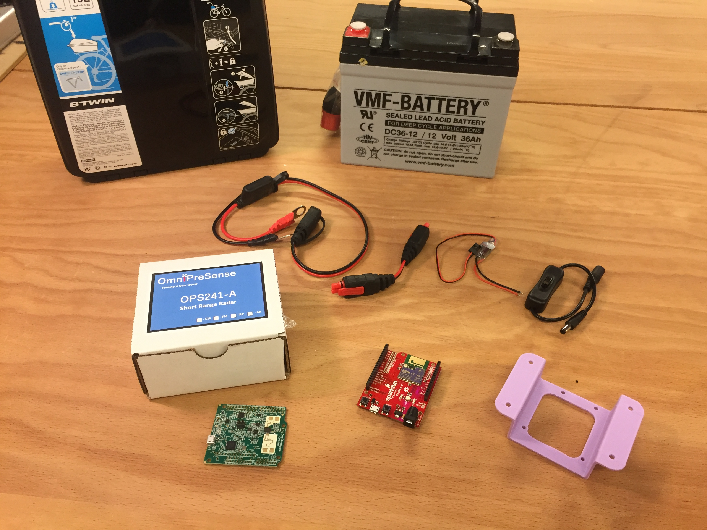
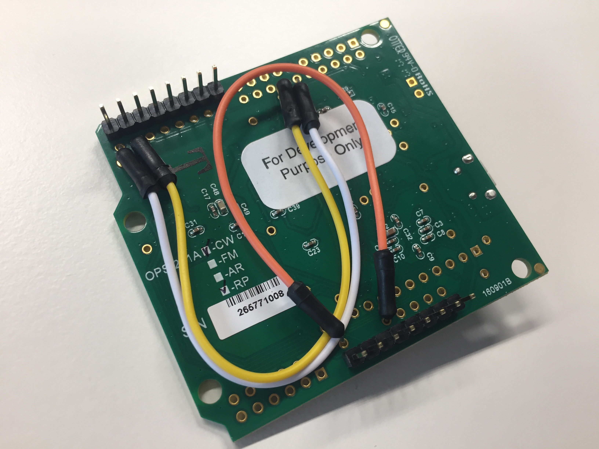

# flitsfiets

Bouw zelf je eigen radar om undercover snelheidsmetingen van voertuigen uit te voeren.

We ontwikkelden bij imec City of Things samen met burgerbeweging 30 MAX! een flitsfiets. Met deze flitsfiets kan de burgerbeweging zelf snelheidsmetingen van de voertuigen in hun buurt uitvoeren. Door objectieve data te verzamelen kunnen ze hun bezorgdheden met meer kracht aan het beleid communiceren. Met deze repository willen we iedereen in staat stellen hun eigen radar te bouwen en samen te werken aan meer respect voor de zone 30.

# Onderdelen

Alle onderdelen (behalve 1 3D print) zijn gemakkelijk off the shelf te verkrijgen. Je kan ze online bestellen en zo je eigen flitsfiets 
bouwen. 

* We gebruiken een radar van Omnipresense. Deze is heel duur (bijna 180€), maar komt met een certificaat dat ie minder dan 1% fout op de metingen maakt (minder dan 1 mijl per uur fout op een meting van 130 mijl per uur). Een goed werkende radar is een vereiste om correcte en objectieve metingen uit te voeren.
* De radar is een shield dat past op een klassieke Arduino. We gebruiken een Photon Redboard van Sparkfun. Dit bord gebruikt een wifi module van particle.io en kan ook Arduino shields ontvangen.
* We voeden de radar met een deep cycle autobatterij. Omdat de radar en wifi samen zo'n 3 watt verbruiken is een 12V 36Ah batterij na 8 dagen volledig opgebruikt.
* We gebruiken een combinatie van (Noco) stekkers om de batterij gemakkelijk los te koppelen van de radaropstelling.
* De radaropstelling gebruikt een kleine buck converter om de 12V van de batterij efficiënt om te zetten naar de 5V die de radaropstelling gebruikt.
* De radar wordt in een topcase bagagedrager bevestigd met een ge-3D-printe beugel, bouten en moeren en een montageband.

| Component | Producent | Leverancier | Prijs |
| ------------- | ------------- | --- | -----: |
| [Topcase voor bagagedrager](https://www.decathlon.be/nl/p/topcase-voor-bagagedrager-fiets-onesecondclip/_/R-p-160375?mc=8396337&c=ZWART) | B'twin | Decathlon | €36.00 |
| [OPS-241A radar](https://www.mouser.be/ProductDetail/203-OPS241ACWRP) | Omnipresense | Mouser |   €178.58 |
| [Photon Redboard](https://www.sparkfun.com/products/13321) | Sparkfun | Sparkfun | €31.36 |
| [2.1mm barrel jack met knop](https://www.mouser.be/ProductDetail/485-1125) | Adafruit | Mouser | €2.46 |
| [12V naar 5V buck converter](https://www.mouser.be/ProductDetail/485-1385) | Adafruit | Mouser | €10.52 |
| [Male to male connector](http://www.accucentrale.com/docs/webshop.asp?act=item&itemcode=GC013) | Noco | ACA | ??? |
| [Eyelet connector](http://www.accucentrale.com/docs/webshop.asp?act=item&itemcode=GC002) | Noco | ACA | ??? |
| [Deep cycle batterij](http://www.accucentrale.com/docs/webshop.asp?act=item&itemcode=DC36-12) | VMF | ACA | ??? |
| Beugel | 3d print | |
| Fiets(wrak) | | |
| Fietsslot | | |
| Varia ijzerwaren (montageband, bouten, moeren) | | |

# Bouwen

## Radar

We moeten enkele aanpassingen aanbrengen aan de radarmodule en een aantal settings in de radarmodule instellen.

### Radar patchen

We bereiden de radar voor zodat we hem kunnen uitlezen als een hardware serial device, zoals beschreven in de [Application Note van Omnipresense](https://omnipresense.com/wp-content/uploads/2018/11/AN-014-B_UART-and-Arduino-Support.pdf).

* Zet pinheaders op de voedings- en hardware serial pinnen op de omnipresense. Let op, zet geen pinheaders op de MOSI/MISO pinnen omdat deze voor software serial storingeen zullen zorgen tijdens het gebruik.
* Breng 3 jumperwires aan om de TX/RX en voeding van de radar naar de juiste pinnen van de Sparkfun Photon Redboard te patchen.
  * Verbind TP41 met TP26 (TX naar juiste pin brengen)
  * Verbind TP42 met TP25 (RX naar juiste pin brengen)
  * Verbind VIN met 5V0 (omdat de radar 5V nodig heeft)

## Radar instellingen

Gebruik een seriële monitor om de volgende settings van de radar in te stellen:
* `UK` om de units van de radar in km/u in te stellen
* `R-` om enkel de wagens die van de radar wegrijden te rapporteren
* `R>15` om enkel snelheden van meer dan 15km/u te rapporteren (er lijkt veel noise te zijn onder 15km/u)
* `SL` om 50000 samples per 
* `A!` om deze settings te bewaren in de radar.

Als uw radar het `A!` commando niet ondersteunt dan moet je de firmware van de radar upgraden naar de recentste firmware volgens deze [Appliation Note van Omnipresense](https://omnipresense.com/wp-content/uploads/2018/11/AN-013-B_OPS241-Code-Update.pdf).
